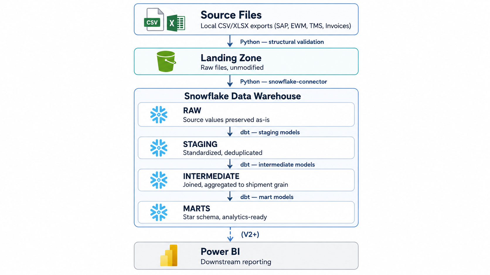
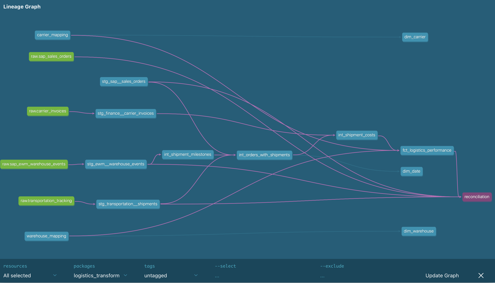
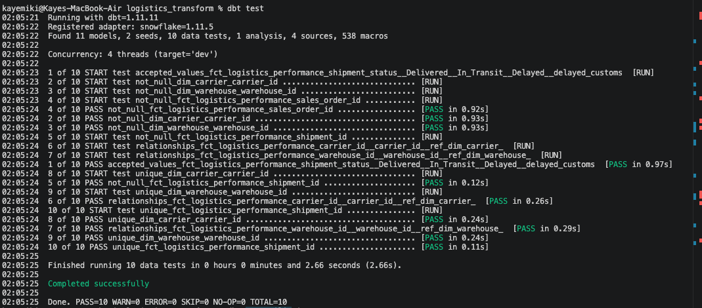
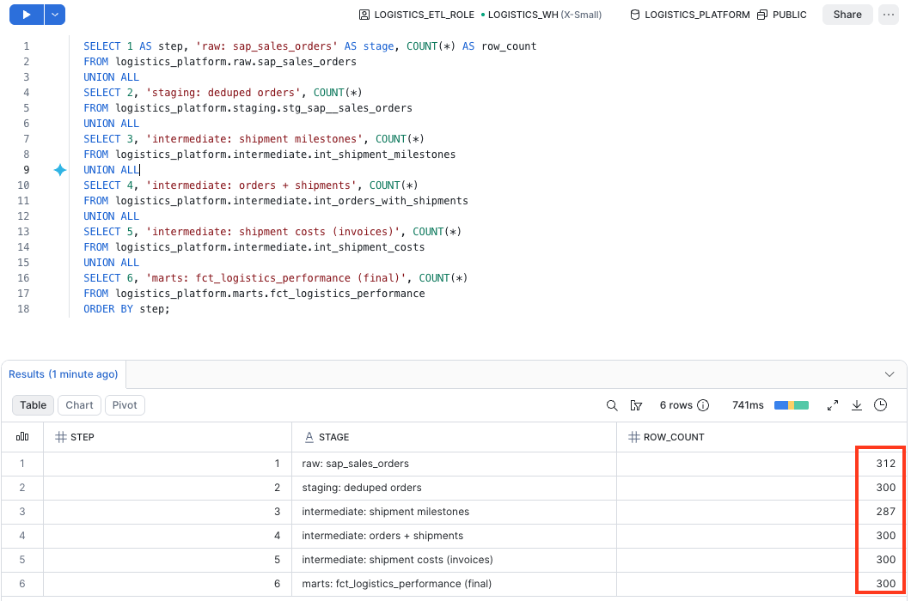
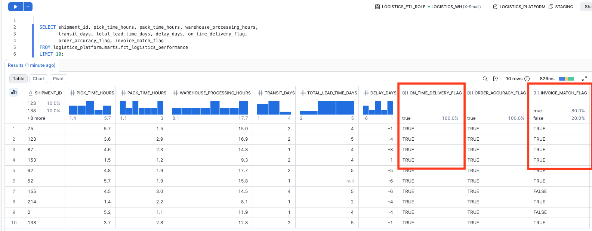

# Supply Chain ELT Pipeline

An end-to-end ELT pipeline built for a Japan-based B2B automotive aftermarket parts distributor, turning fragmented logistics data — SAP orders, warehouse events, transportation tracking, and carrier invoices — into a single trusted, analytics-ready mart.

**Status:** V1 complete — reliable, tested shipment-level data. V2–V5 add inventory/procurement, multi-carrier invoicing, orchestration, and decision-support features (see Roadmap in `/docs`).

---
🎥 Project Demo

[](https://youtu.be/oeM85nAuBWk)
---

## Business Problem

The distributor supplies repair shops and dealerships across Japan with aftermarket parts, where a delayed shipment doesn't just miss an SLA — it means a vehicle sits on the lift and a shop loses a day of billable work. Operational data lived across SAP S/4HANA, SAP EWM, a manually maintained TMS spreadsheet, and finance invoice exports — with no system talking to any other. Analysts pulled each source separately, cleaned it by hand in Excel, and recalculated the same KPIs in every report. Reporting was slow, the same metric came out differently depending on who built the spreadsheet, and by the time a delayed shipment or an invoice mismatch surfaced, it was too late to act on it.

The underlying question this project answers: **how do you standardize operational data from multiple logistics systems into a single trusted layer that produces the same numbers everywhere, every time?**

## Solution

An automated ELT pipeline that:

- Ingests raw exports from each source system into cloud storage, unmodified — nothing is transformed before it's safely landed
- Loads them into a warehouse and standardizes business logic exactly once, in version-controlled transformation models, instead of once per spreadsheet
- Validates every critical assumption (uniqueness, referential integrity, non-negative costs, valid dates) with automated tests instead of manual spot-checks
- Publishes a single shipment-level mart that any reporting tool can consume without further cleanup

The pipeline is idempotent by design: rerunning it end-to-end on the same source files reproduces identical row counts every time (verified across multiple full runs), so "run it again" is never a risky operation.

## Architecture

V1 follows a 5-layer ELT flow — data lands untouched first, then gets progressively cleaned and modeled:



```
Local files (CSV/XLSX)
    │  Python (ingest.py) — structural validation
    ▼
AWS S3 — landing zone (raw files, unmodified)
    │  Python (snowflake-connector-python)
    ▼
Snowflake — RAW schema (source values preserved as-is)
    │  dbt — staging models + seeds
    ▼
Snowflake — STAGING schema (standardized, deduplicated)
    │  dbt — intermediate models
    ▼
Snowflake — INTERMEDIATE schema (joined, aggregated to shipment grain)
    │  dbt — mart models
    ▼
Snowflake — MARTS schema (star schema, analytics-ready)
    │  (V2+)
    ▼
Power BI
```

**Design principles behind the layering:**

- **Landing zone is read-only downstream** — nothing queries S3 directly; it exists purely as an unmodified audit trail of what was received.
- **RAW preserves source values exactly** — no cleaning happens until dbt, so raw data can always be re-derived from source.
- **Least-privilege access throughout** — a scoped IAM user can only read/write the landing prefix it owns, and a scoped Snowflake role (not `ACCOUNTADMIN`) is used for every pipeline run.
- **No orchestration yet, by design** — every run is manually triggered (`python ingest.py && dbt build`). Scheduling and automated retries are explicitly V4 scope, not an oversight.

## Tech Stack

| Layer | Technology | Notes |
|---|---|---|
| Ingestion | Python (pandas, boto3, openpyxl, snowflake-connector-python) | Structural validation before any load occurs |
| Storage | AWS S3 | `ap-northeast-1`, SSE-S3 encryption, public access blocked |
| Warehouse | Snowflake | XSMALL warehouse, 60s auto-suspend for cost control |
| Transformation | dbt-core / dbt-snowflake (1.11.x) | Staging → intermediate → mart layering, seeds, schema tests |
| Reporting (V2+) | Power BI | Consumes the marts directly — no additional cleaning required |

## Data Sources

Seven synthetic files, generated to mirror real SAP/EWM/TMS exports for a parts distributor's order-to-cash flow (customer orders from repair shops and dealerships → warehouse fulfillment → carrier delivery → invoicing) — including the messiness that comes with them (mixed date formats, inconsistent carrier names, duplicate rows, Excel serials).

| Source file | System | Feeds |
|---|---|---|
| `sap_sales_orders.csv` | SAP S/4HANA | Order dates, quantities, requested delivery dates |
| `sap_ewm_warehouse_events.csv` | SAP EWM | Pick/pack/goods-issue event timestamps |
| `transportation_tracking.xlsx` | TMS (Excel-based) | Carrier, ship date, delivery date, freight cost |
| `carrier_invoices.csv` | Finance (SAP FI-style) | Invoice amounts, posting dates, shipment matching |
| `carrier_mapping.csv` | Google Sheets | Standardizes messy carrier names to one code |
| `warehouse_mapping.csv` | IT-owned lookup | Standardizes warehouse codes |
| `exception_notes_log.csv` | Ops log | Unstructured notes, out of scope for V1 KPIs |

Sources are deliberately staggered in time (orders → warehouse events → shipping → invoicing), so backlog orders and un-invoiced shipments fall out of realistic timing lag rather than being randomly injected flags.

## Pipeline

1. **Extract & validate** — `ingest.py` confirms required columns/sheets are present before touching anything downstream.
2. **Land** — raw files are uploaded to S3 unmodified.
3. **Load** — files are loaded into Snowflake RAW tables, fully overwritten each run, values preserved exactly as received.
4. **Stage** (`dbt`, views) — one model per source: column names standardized to business terms, dates parsed across multiple formats, shipment references normalized, exact duplicates removed.
5. **Integrate** (`dbt`, tables) — the long-format warehouse event log is pivoted into shipment-level milestones; invoices are aggregated to one row per shipment *before* joining, so the ~2% of shipments with duplicate invoice postings don't fan out the grain.
6. **Mart** (`dbt`, tables) — the final star schema is built and tested.



**Data quality is enforced with `dbt test`**, not manual `SELECT` checks: unique/not-null shipment IDs, valid date sequencing, non-negative freight cost, referential integrity to both dimension tables, and accepted-values checks on shipment status.



Every run is traced end-to-end by row count (312 raw → 300 deduplicated → … → 300 final) to confirm nothing was silently dropped or duplicated.



## Data Model

Star schema, grain: **one row per shipment.**

```
                     dim_carrier
                          │
      dim_warehouse ── fct_logistics_performance
                          │
                       dim_date  
```

| Table | Grain / key | Notes |
|---|---|---|
| `fct_logistics_performance` | 1 row per shipment (`shipment_id`) | Order, warehouse, carrier, milestone, cost, and invoice-match fields |
| `dim_carrier` | `carrier_id` | Standardized carrier code, resolved from messy raw names |
| `dim_warehouse` | `warehouse_id` | Standardized warehouse code and name |
| `dim_date` | `date_id` | Date spine bounded by actual order/delivery dates |



All identifiers are natural business keys (no synthetic surrogate keys in V1) — a reasonable simplification while every entity has exactly one source system, flagged as worth revisiting once V2 introduces a second source per entity. Foreign keys to `dim_carrier` and `dim_warehouse` are real, tested relationships; backlog shipments (no carrier/warehouse assigned yet) correctly carry `NULL` rather than a placeholder.

## KPIs Produced

19 KPIs shipped in V1, every one traceable back to a specific raw field — no invented shortcuts:

**Delivery & SLA:** On-Time Delivery Rate, On-Time Dispatch Rate, SLA Compliance, Late Shipment Count

**Warehouse operations:** Pick Time, Pack Time, Warehouse Processing Time, Warehouse Throughput, Warehouse Productivity, Order Accuracy Rate

**Lead time & flow:** Transit Time, Total Lead Time, Order Cycle Time, Fulfillment Time, Backlog Volume, Backlog Aging

**Cost & carrier:** Shipping Cost per Order, Carrier Performance, Shipping Performance

Inventory/procurement KPIs (V2), finance and invoice-matching KPIs (V3), and returns/quality KPIs (future) are scoped but not yet built — see the roadmap docs for what's next.

## Repository Structure

```
supply-chain-elt-pipeline/
├── README.md
├── ingestion/
│   ├── ingest.py            # extract, validate, land, load
│   ├── config.py
│   ├── validators.py
│   ├── requirements.txt
│   └── .env.example         # template — copy to .env and fill in real values
├── data/
│   └── raw/                  # synthetic source files (sap_sales_orders.csv, etc.)
├── logistics_transform/      # dbt project
│   ├── dbt_project.yml
│   ├── analyses/
│   │   └── reconciliation.sql   # row-count reconciliation query
│   ├── models/
│   │   ├── staging/           # stg_sap__sales_orders, stg_ewm__warehouse_events, ...
│   │   ├── intermediate/      # int_shipment_milestones, int_orders_with_shipments, ...
│   │   └── marts/             # fct_logistics_performance, dim_carrier, dim_warehouse, dim_date, schema.yml (tests)
│   ├── seeds/                 # carrier_mapping.csv, warehouse_mapping.csv
│   ├── macros/                # generate_schema_name.sql
│   ├── snapshots/              # empty for V1
│   └── tests/                  # empty for V1 — generic tests defined in models/marts/schema.yml instead
└── docs/
    ├── architecture_diagram.png
    ├── lineage_graph.png
    ├── dbt_test.png
    ├── reconciliation.png
    └── fact_table.png
```
